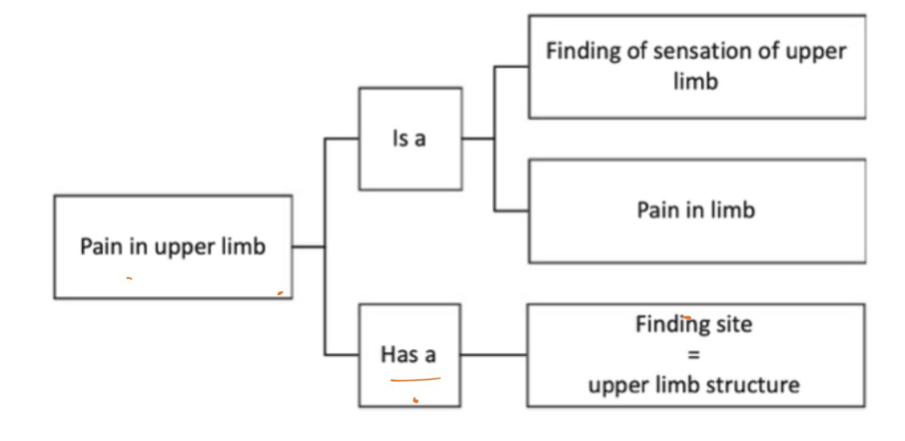

# CM2
## Table of Contents
- [CM2](#cm2)
  - [Table of Contents](#table-of-contents)
  - [QUIZ 1 2025](#quiz-1-2025)
    - [Computing for Medicine - Quiz 1 Solution](#computing-for-medicine---quiz-1-solution)
      - [Multiple Choice Questions (MCQs)](#multiple-choice-questions-mcqs)
      - [Short-Answer Questions](#short-answer-questions)

## QUIZ 1 2025
Here is a detailed solution to Quiz 1, drawing upon the provided course material.

---

### Computing for Medicine - Quiz 1 Solution

**Max. Marks - 100**

---

#### Multiple Choice Questions (MCQs)

1.  **In a scenario where two hospitals exchange allergy information for a patient using a FHIR standard syntax, but one system interprets "penicillin allergy" as a drug intolerance instead of an allergy, what is the most likely issue?**
    *   **Correct Answer: b) Semantic interoperability failure**
    *   **Explanation:** This scenario highlights a **semantic interoperability failure** because, while the systems successfully exchanged data (syntactic interoperability), they did not understand the *meaning* of the exchanged information in the same way. One system misinterpreted "penicillin allergy" as a general "drug intolerance," indicating a lack of shared understanding of clinical terminology and concepts.

2.  **Your friend is a medical intern who thinks that an electronic health record (EHR) is just a scanned PDF of medical reports. What will you tell them to correct their thinking?**
    *   **Correct Answer: b) EHR is a computer-processable collection of a patient's health data with a standardized model**
    *   **Explanation:** An **EHR is defined as a securely stored, computer-processable collection of a patient's health information** that supports ongoing healthcare and includes diverse data like consultations, tests, and prescriptions. It is much more than just a scanned PDF; it uses standardized codes and data formats to enable storage, exchange, and analysis by computers.

3.  **Your clinician friend shared a dataset using a shared Google Drive link named "data_final_use_this.csv". You find that I. No fear of persistent identifier is given. II. Metadata is missing. III. The link often breaks when ownership changes. Which FAIR principle is MOST violated here?**
    *   **Correct Answer: a) Findable**
    *   **Explanation:** The **Findable** principle of FAIR data requires that data has a **persistent unique identifier** and rich metadata. The issues described—no persistent identifier, missing metadata, and a broken link—all directly violate the "Findable" principle by making the data difficult or impossible to locate and identify reliably.

4.  **You are doing a study that needs to identify patients with diabetes from data of two hospitals. One hospital uses an electronic health record system that uses ICD-10 codes, another uses SNOMED CT. What technique is essential before data integration?**
    *   **Correct Answer: b) Ontology mapping**
    *   **Explanation:** To integrate data from systems using different coding standards like ICD-10 and SNOMED CT, **ontology mapping** is essential. Ontologies and terminologies provide standardized sets of terms and define concepts and relationships formally. Mapping them allows for common vocabularies that all systems can understand, ensuring semantic interoperability and accurate data integration.

5.  **Simpson’s paradox is a phenomenon where the overall group effects are opposite to that of subgroups. This is caused due to:**
    *   **Correct Answer: b) Confounding variables**
    *   **Explanation:** **Simpson's Paradox** occurs when a trend appears in different groups of data but disappears or reverses when these groups are combined. This paradox is typically caused by a **confounding variable** that is not accounted for when aggregating the data. For example, in vaccine efficacy data, age was identified as a confounder that led to Simpson's Paradox.

6.  **A retrospective study design differs from a prospective study design because it looks at data that were collected prior to initiation of the study. What is NOT true as a limitation of this design?**
    *   **Correct Answer: c) It is more expensive as compared to prospective studies**
    *   **Explanation:** A **retrospective study looks back at existing records**. Limitations include high risk of selection/information bias, limited control over data quality, and difficulty establishing temporal relationships. However, retrospective studies are generally **less expensive** than prospective studies because they utilize already collected data, avoiding the costs and time associated with new data collection.

7.  **Which of the following is an example of confounding?**
    *   **Correct Answer: a) Coffee drinking is associated with lung cancer because coffee drinkers are more likely to smoke.**
    *   **Explanation:** **Confounding** occurs when a hidden variable affects both the cause (exposure) and the effect (outcome), making it appear as if there's a direct link. In this example, smoking is the confounder: it is associated with coffee drinking and is a direct cause of lung cancer, thereby creating a spurious association between coffee drinking and lung cancer.

8.  **Which is NOT true of human physiological systems? They:**
    *   **Correct Answer: b) are highly optimal**
    *   **Explanation:** Biological systems, including human physiological systems, are characterized as adaptive, self-organizing, constantly changing, oscillatory, far from equilibrium, sensitive, and **not always optimal**. Physical efficiency in one aspect (like perfect networks in lungs) can even make a system more fragile, demonstrating that they are not always perfectly optimal for health.

9.  **In DAG representing Smoking → Lung Cancer – Asbestos Exposure, the variable Asbestos Exposure is:**
    *   **Correct Answer: c) A confounder**
    *   **Explanation:** In the context of studying the relationship between Smoking (exposure) and Lung Cancer (outcome), if Asbestos Exposure is a variable that is both associated with Smoking (e.g., certain occupations lead to both smoking and asbestos exposure) and directly causes Lung Cancer, then **Asbestos Exposure is a confounder**. A confounder influences both the independent variable (smoking) and the dependent variable (lung cancer), potentially distorting the observed relationship between smoking and lung cancer.

10. **A radiology AI system predicts tumor presence with high accuracy on training scans. But in practice, its performance drops because new scans are stored in a different file format and resolution. This is an example of:**
    *   **Correct Answer: a) Interoperability challenge**
    *   **Explanation:** The issue described, where the AI system fails due to differences in file format and resolution of new scans, is a **technical interoperability challenge**. For effective use, systems must be able to exchange and *use* information, which includes compatibility in data formats and structures.

11. **Which of the following is an example of structured healthcare data?**
    *   **Correct Answer: c) Blood pressure readings**
    *   **Explanation:** **Structured data** is organized in clear fields and tables. Blood pressure readings are typically recorded as numeric values in specific fields within an EHR, making them structured data. X-ray images and doctor's narrative notes are examples of unstructured data.

12. **A policymaker sees a rise in obesity rates alongside increased smartphone use and concludes that Smartphones cause obesity. This is an error due to:**
    *   **Correct Answer: d) Confounding**
    *   **Explanation:** This conclusion represents an error due to **confounding**. It's likely that other, unmeasured factors (confounders) like lifestyle, diet, or socioeconomic status are influencing both increased smartphone use and obesity, rather than a direct causal link between smartphones and obesity.

13. **We think about interoperability to enable high-fidelity exchange of data, meaning, workflow, and action. Workflows are a part of:**
    *   **Correct Answer: c) Process Interoperability**
    *   **Explanation:** The four levels of interoperability include **Process Interoperability**, which specifically refers to the ability of data to be used effectively within workflows or business logic. The phrase "meaning" refers to semantic interoperability, "exchange of data" to syntactic/technical, and "action" or "improving care" to human/clinical interoperability.

14. **Which of the following best explains why EHRs are better than paper records?**
    *   **Correct Answer: b) They allow structured storage, interoperability, and analytics**
    *   **Explanation:** EHRs provide significant advantages over paper records by offering **structured storage**, which facilitates data exchange and processing for **interoperability** and advanced **analytics**. This enables improved patient care, research, and streamlined workflows.

15. **What is the biggest challenge in using unstructured healthcare data?**
    *   **Correct Answer: b) It lacks a predefined organization**
    *   **Explanation:** Unstructured healthcare data, such as doctor's notes and radiology reports, is in **free text** or narrative form and **lacks a predefined organization**. This inherent lack of structure makes it challenging for computers to directly understand and process for analysis without advanced techniques like Natural Language Processing (NLP). While it can be digitized (e.g., typed text), extracting meaningful information from it is the core difficulty due to its disorganization.

---

#### Short-Answer Questions

**1. What is an ontology? How is it different from a simple data dictionary? Explain with an example and create a small ontology graph depicting your understanding of any four medical terms using is-a, has-a process.**

*   **What is an Ontology?**
    An ontology provides both a **shared vocabulary** and the **rules or constraints for how those terms relate**. It formally defines concepts, attributes, and relationships, allowing computers to reason about data meaningfully. Ontologies use **description logic** to enable this reasoning, consistency checking, and logical inference. They are represented as a **directed graph with cycles**, allowing for complex hierarchical and associative relationships.

*   **How is it different from a simple data dictionary?**
    A simple data dictionary is essentially a list of terms and their definitions, similar to a **controlled vocabulary** or **terminology**. It provides a standardized set of terms but typically lacks the formal logical structure, complex relationships, and reasoning capabilities of an ontology. An ontology, in contrast, is a **generalized model explaining relationships between entities based on common properties**, not just individual data points. A knowledge graph, for instance, is built using data and an ontology.

*   **Example and small ontology graph:**
    Let's consider an example with four medical terms: "Disease," "Infectious Disease," "Pneumonia," and "Virus."

    *   **Concepts:** Disease, Infectious Disease, Pneumonia, Virus
    *   **Relationships:**
        *   "Pneumonia" **is-a** "Infectious Disease"
        *   "Infectious Disease" **is-a** "Disease"
        *   "Pneumonia" **has-cause** "Virus" (or "caused-by")

    ```
            Disease
              ↑ (is-a)
     Infectious Disease
              ↑ (is-a)
            Pneumonia
           /         \
    (has-cause)     (is-a type of)  -- (not explicitly in graph, but implied by 'is-a')
           ↓
         Virus
    ```
    
    *   **Explanation:** This graph shows a hierarchical "is-a" relationship, where "Pneumonia" is a specific type of "Infectious Disease," which in turn is a type of "Disease." It also shows a "has-cause" relationship, indicating that a "Virus" can cause "Pneumonia."

**2. SNOMED CT concepts are more than just terms. They carry certain essential properties as discussed in class. Explain the essential properties of a SNOMED CT concept. What do you understand by Fully Specified Name (FSN)?**

*   **Essential Properties of a SNOMED CT Concept:**
    1.  **Unique Machine-Readable ID:** Each concept in SNOMED CT has a unique identifier that is machine-readable, allowing for computational processing regardless of language.
    2.  **Concept-Oriented (Constant Meaning):** SNOMED CT is fundamentally concept-oriented, meaning the clinical meaning of a concept remains constant and unchanging, independent of language or presentation.
    3.  **Hierarchical Relationships ("Is-A"):** Every concept (except the root) has at least one supertype, forming an "is-a" hierarchy. This taxonomic structure allows for inheritance and classification, defining how concepts relate to broader categories.
    4.  **Defined by Relationships:** Concepts are defined not only by their place in the hierarchy but also by **defining attributes** that specify additional characteristics, enabling precise automated inference for "sufficiently defined concepts".

*   **Fully Specified Name (FSN):**
    The **Fully Specified Name (FSN)** is a type of description associated with a SNOMED CT concept. Its **purpose is to provide unique and unambiguous identification** of the concept. The FSN is not intended for end-users but rather for technical or administrative use. It follows a specific format, containing the concept name followed by a suffix in parentheses that indicates its primary hierarchy (e.g., "myocardial infarction (disorder)"). This suffix ensures precise identification of the concept across different systems and contexts.

**3. Phrases such as "Possible fracture of arm" and "Patient is recovering well" are not valid SNOMED CT concepts. Why? Use a method to break them down using Post-coordinated valid concepts (need not be actual SNOMED-CT concepts).**

*   **Why they are not valid SNOMED CT concepts:**
    SNOMED CT concepts represent atomic clinical ideas, findings, procedures, or disorders. The phrases "Possible fracture of arm" and "Patient is recovering well" are more complex clinical expressions that convey **nuance, probability, or subjective assessment** rather than a single, atomic clinical fact that would typically be a pre-coordinated SNOMED CT concept.
    *   "**Possible fracture of arm**": The term "possible" indicates uncertainty or suspicion, which is a qualifier of a finding rather than an intrinsic part of the "fracture" concept itself. SNOMED CT aims to represent concrete clinical facts.
    *   "**Patient is recovering well**": This is a subjective assessment of a patient's status or progress, a narrative statement, rather than a specific medical condition, procedure, or finding defined as a singular concept. It encapsulates multiple ideas like "patient," "recovery," and "good progress."

*   **Breaking them down using Post-coordinated valid concepts:**
    **Post-coordinated expressions** allow for the combination of multiple concept identifiers and attributes to represent complex, specific, or unusual clinical situations that are not covered by a single pre-coordinated concept.

    *   **"Possible fracture of arm":**
        *   **Primary Concept:** `Fracture (finding)`
        *   **Attributes (with values):**
            *   `Finding site (attribute)` : `Arm structure (body structure)`
            *   `Certainty (attribute)` : `Possible (qualifier value)`
        *   **Post-coordinated representation:** `Fracture (finding) : Finding site = Arm structure (body structure), Certainty = Possible (qualifier value)`

    *   **"Patient is recovering well":**
        *   **Primary Concept:** `Clinical finding (finding)`
        *   **Attributes (with values):**
            *   `Associated with (attribute)` : `Patient (person)`
            *   `Progress (attribute)` : `Improvement (qualifier value)`
            *   `Severity (attribute)` : `Good (qualifier value)`
        *   **Post-coordinated representation:** `Clinical finding (finding) : Associated with = Patient (person), Progress = Improvement (qualifier value), Severity = Good (qualifier value)`

**4. You are building a predictive model for ICU patients. The data available include:
*   Blood pressure readings
*   Heart rate findings
*   X-ray, CT and MRI images
*   Text notes capturing patient history, progression and treatment**

**a) Classify each of the above as structured, semi-structured, or unstructured.**
**b) Which type of data is most directly usable for traditional statistical models, and why?**
**c) What will be your approach to use unstructured data (e.g., notes) for predictive modeling?**

*   **a) Classify each of the above as structured, semi-structured, or unstructured:**
    *   **Structured Data:**
        *   **Blood pressure readings**
        *   **Heart rate findings**
    *   **Unstructured Data:**
        *   **X-ray, CT and MRI images** (These are image files, rich in information but not organized in predefined fields for direct computational analysis like numeric data)
        *   **Text notes capturing patient history, progression and treatment**
    *   (No semi-structured data is explicitly listed in this scenario, though it could exist in other contexts.)

*   **b) Which type of data is most directly usable for traditional statistical models, and why?**
    **Structured data** (Blood pressure readings, Heart rate findings) is most directly usable for traditional statistical models.
    *   **Reason:** Structured data is organized in clear fields, tables, and typically consists of numerical or categorical values that are immediately computable. This format allows for straightforward application of statistical methods without extensive preprocessing or interpretation.

*   **c) What will be your approach to use unstructured data (e.g., notes) for predictive modeling?**
    To use unstructured data like **text notes** for predictive modeling, the primary approach would be **Natural Language Processing (NLP)**.
    *   **Process:** NLP involves computational methods to **extract information and meaning from text** using linguistic rules. This typically includes:
        1.  **Named Entity Recognition (NER):** Identifying and classifying clinical concepts (e.g., diseases, symptoms, medications, procedures) within the free text.
        2.  **Concept Mapping:** Linking the extracted terms to standardized terminologies and ontologies like **UMLS, SNOMED CT, and RxNorm** to ensure consistent interpretation and facilitate computational analysis. This standardizes various ways of expressing the same concept (e.g., "atrial fibrillation" and "auricular fibrillation" map to the same concept).
        3.  **Feature Extraction:** Converting these standardized concepts and their relationships into structured features (e.g., presence/absence of a condition, frequency, severity) that can then be fed into machine learning models for prediction.
    *   For **image data (X-ray, CT, MRI)**, the approach would involve **Computer Vision** or **Image Processing techniques** to analyze visual patterns and extract features relevant for the predictive model. These features, once extracted, can then be integrated with other structured data.