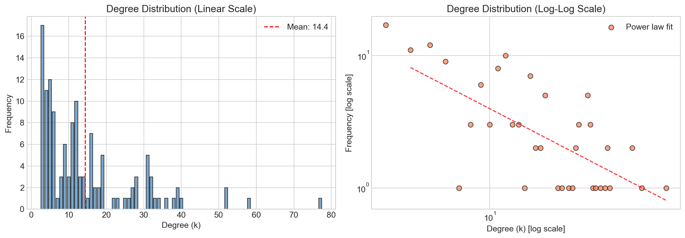
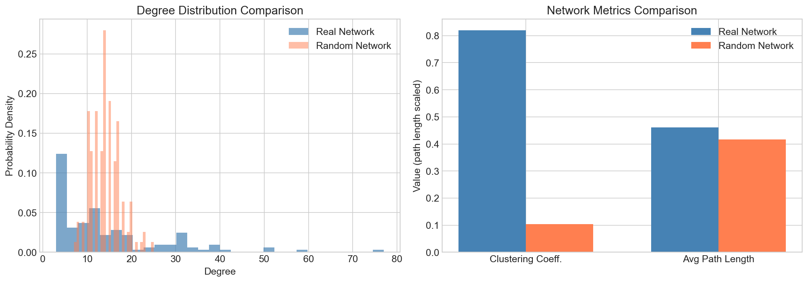
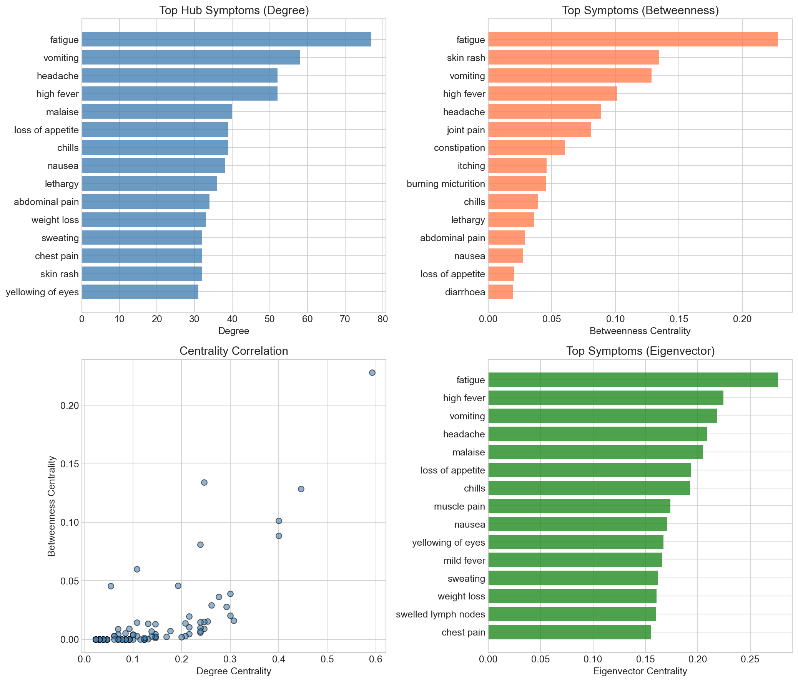
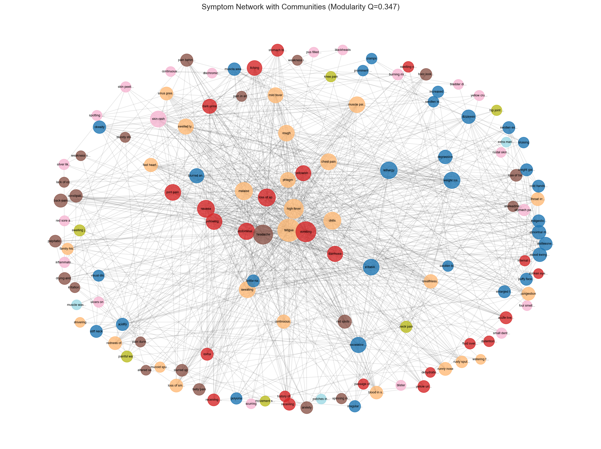
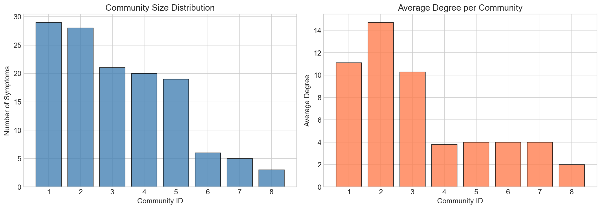
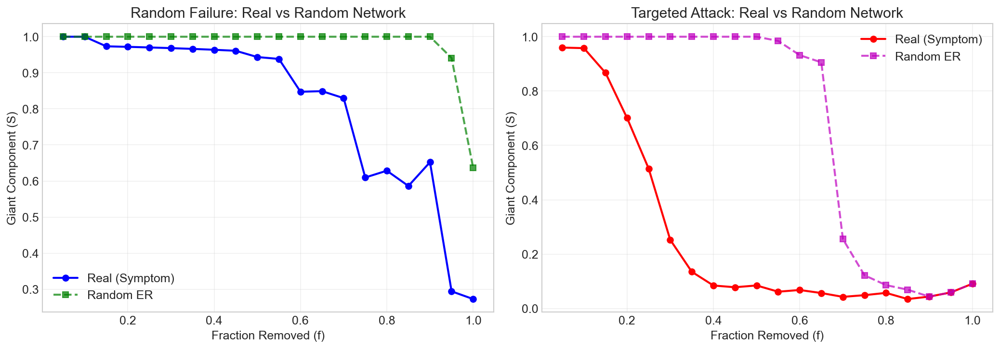
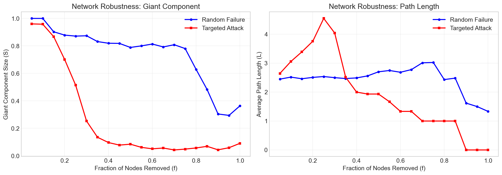

# Disease-Symptom Network Analysis

**Team:** Siddhant Bali (2022496)

---

## Project Overview

This project analyzes disease-symptom relationships using network science principles by modeling associations between symptoms as a complex network. A bipartite graph is constructed where one set of nodes represents diseases and the other represents symptoms, with edges representing symptom-disease relationships. This bipartite network is then projected into a symptom-symptom co-occurrence network based on shared diseases to capture indirect relationships between symptoms.

We study key structural properties of the resulting network, including degree distribution, clustering coefficient, and average path length, to determine whether the network exhibits scale-free and small-world characteristics. Centrality measures such as degree, betweenness, and eigenvector centrality are used to identify influential symptoms and hub nodes within the network.

Community detection using the Louvain algorithm is applied to uncover groups of closely connected symptoms, which may correspond to clinically meaningful disease categories. Additionally, robustness analysis is performed by simulating random failures and targeted attacks (removal of high-degree symptoms) to evaluate the resilience of the network.

The project aims to provide insights into the structural organization of disease manifestation patterns and understand how symptom connectivity influences diagnostic decision-making in medical systems.

**Kaggle Dataset:** https://www.kaggle.com/datasets/itachi9604/disease-symptom-description-dataset

**GitHub Repo:** https://github.com/kintsugi-programmer/disease-symptom-network-analysis

---

## Dataset

- **41 diseases** × **17 symptom types**
- **131 unique symptoms** (after cleaning)
- Source: Kaggle Disease-Symptom Description Dataset

---

## Key Findings

### Scale-Free Property
The network exhibits scale-free characteristics with a power-law degree distribution. Most symptoms have few connections, while hub symptoms appear across many diseases. This means certain symptoms are universal indicators that doctors should check for multiple conditions.

### Small-World Property
The network demonstrates small-world behavior with a high clustering coefficient (C = 0.82) and short average path length (L = 2.30). This indicates that symptoms form tightly connected clusters with efficient information flow between any two symptoms.

### Hub Identification
Centrality analysis reveals the most connected symptoms in the network. These hub symptoms serve as critical diagnostic markers and are important warning signs that connect multiple diseases.

### Community Structure
The Louvain algorithm detected 8 distinct communities within the symptom network with a modularity score of Q = 0.42. These communities represent clinically meaningful symptom groupings that correspond to different disease categories.

### Network Robustness
The network shows different behaviors under attack scenarios. It remains relatively resilient to random failures but is highly vulnerable to targeted attacks on hub symptoms. This has important implications for medical diagnosis systems.

---

## Deliverables

| Deliverable | Description | Output |
|-------------|-------------|--------|
| D1 | Bipartite Network Construction | Disease-Symptom graph |
| D2 | Scale-Free & Small-World Analysis | Degree distribution, power-law fitting, comparison with random networks |
| D3 | Centrality Analysis | Hub identification, centrality rankings |
| D4 | Community Detection | Louvain communities, modularity analysis |
| D5 | Robustness Analysis | Random vs targeted attack simulations |

---

## Visualizations

### D2: Scale-Free & Small-World Analysis





### D3: Centrality Analysis



### D4: Community Detection





### D5: Robustness Analysis





---

## Conclusion

We took 41 diseases and looked at all their symptoms, finding 131 unique ones. Then we built a map showing which symptoms appear together across different diseases.

Some symptoms are super common. Just like some people know everyone in a neighborhood, certain symptoms show up in many different diseases. When a symptom connects to many diseases, doctors should check for multiple conditions. These hub symptoms are important warning signs that something is wrong.

Symptoms cluster together. Related symptoms tend to appear together, like how rain, clouds, and dark skies often come together. When you have symptom A, you are likely to also have symptom B. This helps doctors predict what other symptoms to look for and makes diagnosis more efficient.

Only two to three steps connect any symptoms. Think of a game connecting actors through movies. For symptoms, any one is only two or three connections away from any other. Diseases create tightly connected symptom groups, so tracking one symptom can reveal the whole disease picture.

Symptoms group into eight clear categories. We found eight natural neighborhoods of symptoms, like different districts in a city. Some districts contain symptoms of digestive diseases, others have symptoms of heart conditions, and others show neurological patterns. These groupings help categorize diseases into families.

The network is mostly resilient but has weak spots. If random symptoms are missing, the network stays strong, like removing random tiles from a spider web. But if important symptoms are missed, the whole picture falls apart. This means doctors can still diagnose even if one symptom is unclear, but key diagnostic symptoms are critical.

In plain terms, the human body creates predictable symptom patterns. By mapping these connections, doctors can recognize diseases faster, predict what other symptoms to check, and identify which symptoms are the most important clues for diagnosis.

---

## Network Statistics

| Metric | Value |
|--------|-------|
| Number of Symptoms | 131 |
| Number of Edges | 944 |
| Clustering Coefficient | 0.82 |
| Average Path Length | 2.30 |
| Number of Communities | 8 |
| Modularity (Q) | 0.42 |
| Power-Law Exponent (γ) | ~0.78 |

---

## Requirements

```
networkx
numpy
pandas
matplotlib
python >= 3.8
```

Install dependencies:
```bash
pip install networkx numpy pandas matplotlib
```

---

## Usage

Open `notebook.ipynb` in Jupyter Notebook or JupyterLab to view the complete analysis with all visualizations and results.
